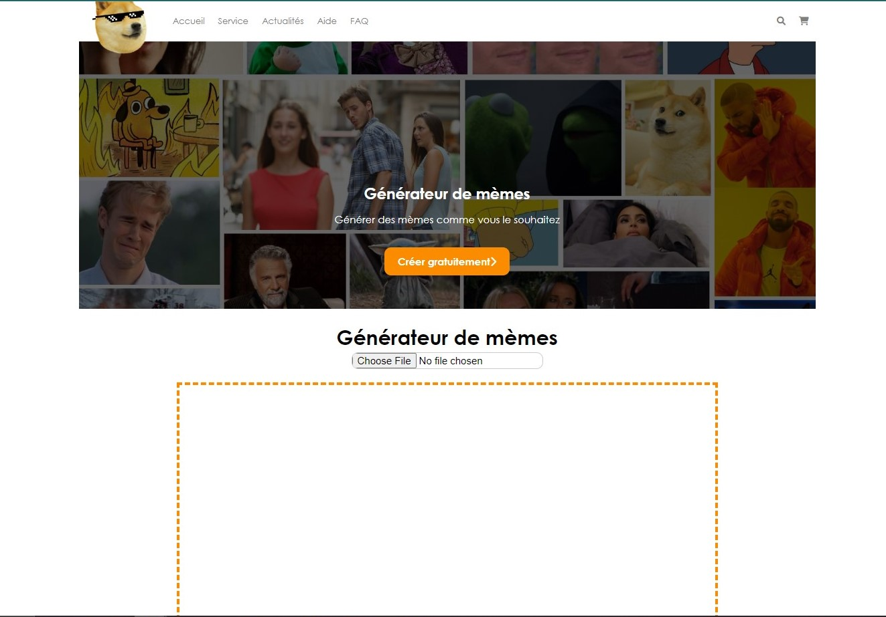

# Générateur de Mèmes

Ce projet est un générateur de mèmes en ligne où les utilisateurs peuvent télécharger des images, ajouter du texte, et créer rapidement des mèmes. L'application permet également de visualiser, télécharger et partager les mèmes créés.

---
## Accéder Directement au Site

Vous pouvez accéder directement au site en suivant ce lien : [Générateur de Mèmes](https://mini-projet-supinfo-zerarga.netlify.app/)

---

## Fonctionnalités

- **Téléchargement d'Images :** Les utilisateurs peuvent télécharger des images depuis leur ordinateur.
- **Ajout de Texte :** Possibilité d'ajouter du texte personnalisé sur l'image.
- **Aperçu en Temps Réel :** Visualisation instantanée des modifications apportées à l'image.
- **Téléchargement et Partage :** Les utilisateurs peuvent télécharger leurs mèmes créés et les partager sur les réseaux sociaux.
- **Galerie :** Une section pour visualiser les mèmes précédemment créés.

---

## Aperçu



---
## Accéder Directement au Site

Vous pouvez accéder directement au site en suivant ce lien : [Générateur de Mèmes](https://mini-projet-supinfo-zerarga.netlify.app/)

---

## Installation

1. Clonez le repository :

    ```bash
    git clone https://github.com/AmineSen0AT0/Mini_Projet_Memes.git
    ```

2. Ouvrez le dossier du projet :

    ```bash
    cd Mini_Projet_Memes
    ```

3. Ouvrez le fichier `index.html` dans votre navigateur web.

---

## Technologies Utilisées

- HTML
- CSS
- JavaScript

---

## Contribuer

Les contributions sont les bienvenues !

---

## Licence

SOON: Ce projet est sous licence [MIT](LICENSE).
